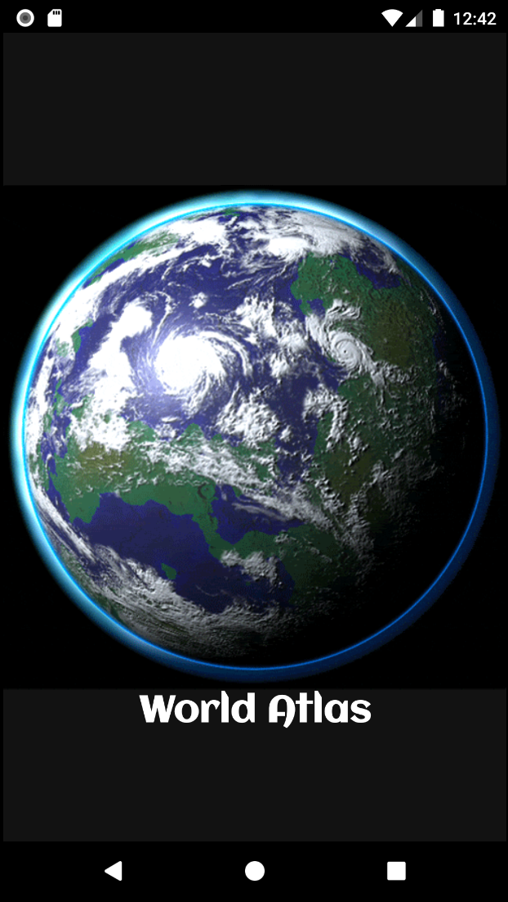
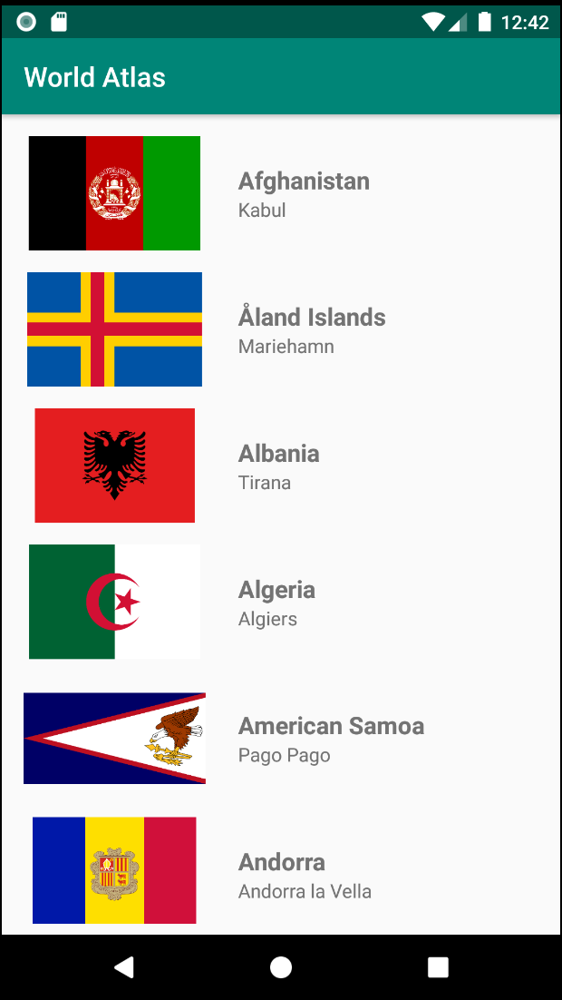

## WORLD ATLAS
#### Created by Raymond Gitonga

### Description
A simple application that displays countries and their capital cities. The app uses clean architecture
using MVVM, Network calls using Retrofit and rxJava, dependency injection using Dagger2. And testing using 
Mockito

### Technologies Used

### Screenshots

 Splash screen                 |  Main screen                     | 
:-----------------------------:|:--------------------------------:|
      |  | 
   

### Features
- :white_check_mark: Kotlin
- :white_check_mark: MVVM
- :white_check_mark: Rest with retrofit
- :white_check_mark: Glide
- :white_check_mark: rxJava
- :white_check_mark: Dagger 2 
- :white_check_mark: Mockito

### Contact details
You can contact me through my email raytosh95@gmail.com

### License
MIT 2019 Raymond Gitonga

